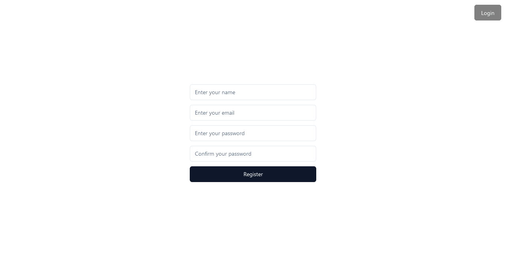
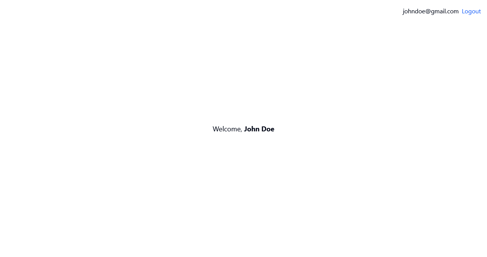
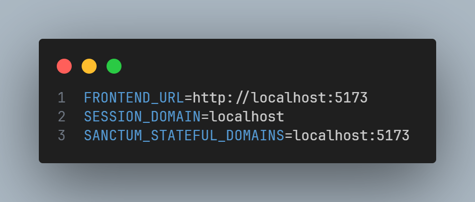
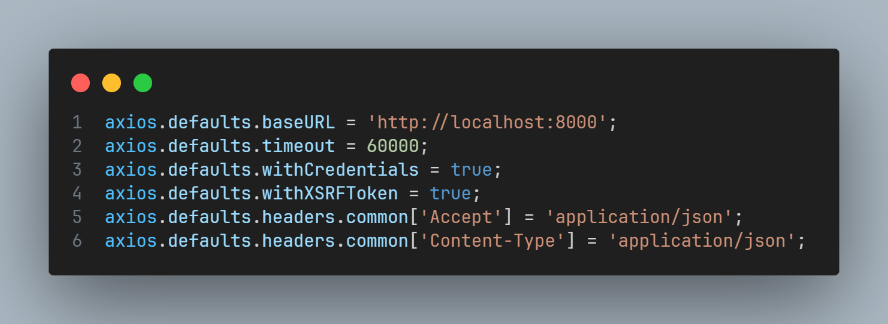
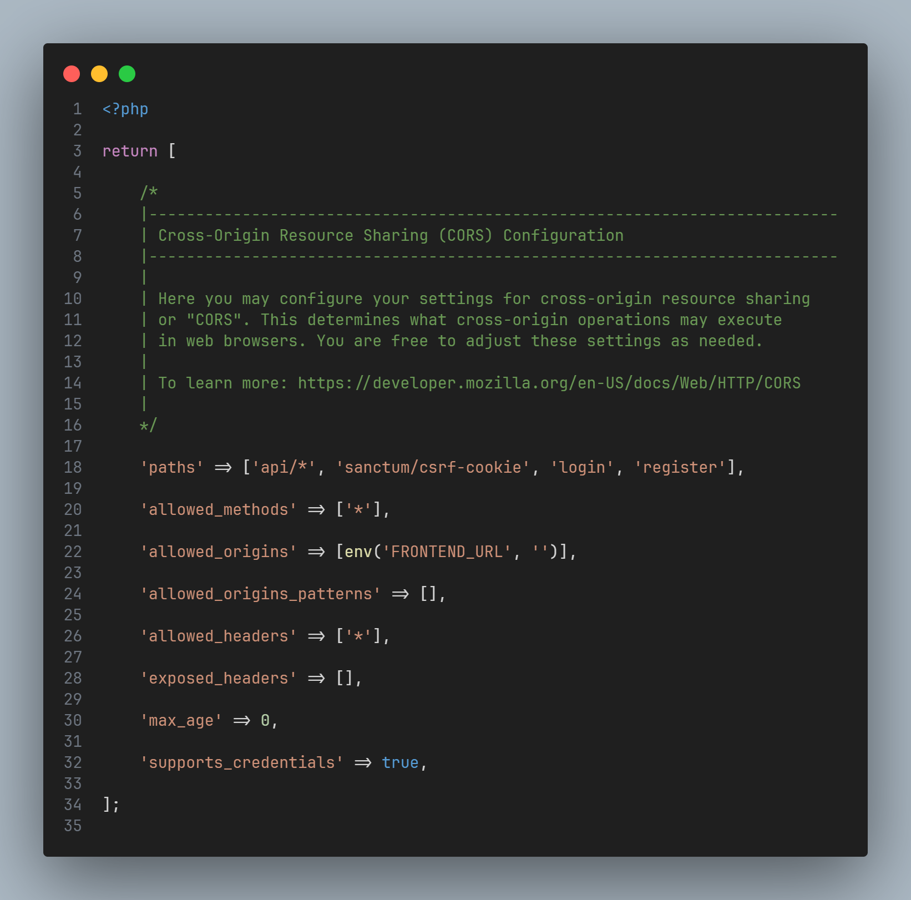
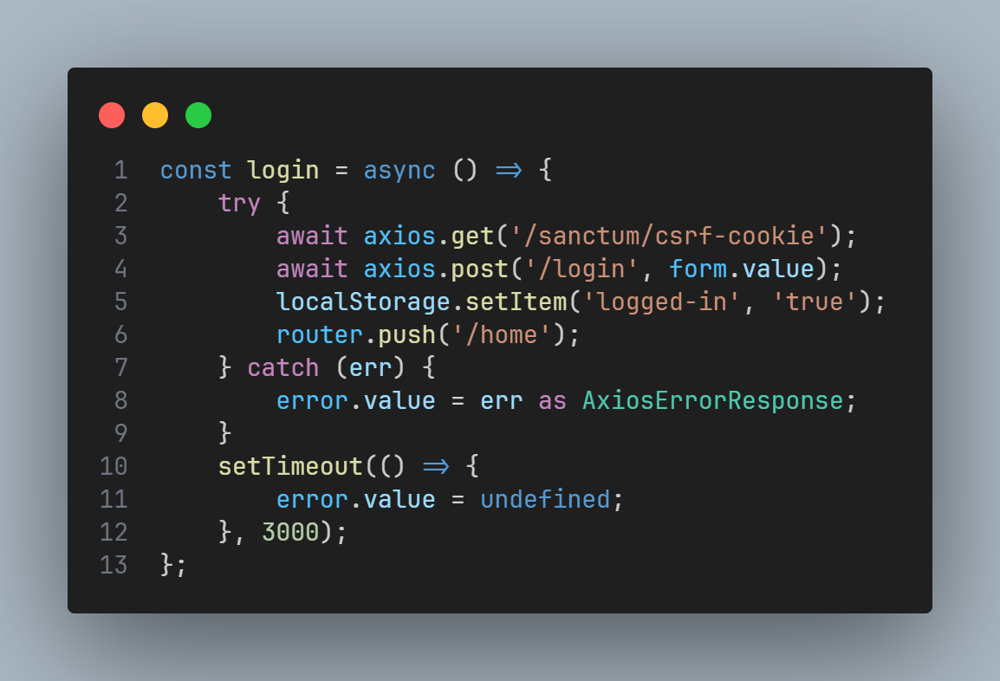
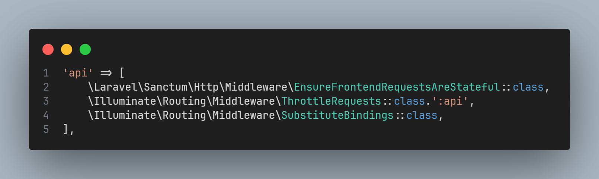

# Effortless SPA Setup: Laravel (Sanctum) + Vue.js + Shadcn

Our SPA solution simplifies the setup process for developers, seamlessly integrating Laravel's Sanctum for authentication on the backend and Vue.js for dynamic frontend interactions. Shadcn enhances the user interface, aiding developers in resolving CORS and unauthorized access issues effortlessly. With this streamlined combination, developers can focus on building their applications without worrying about authentication complexities, ensuring a smooth and secure user experience from start to finish.

## Overview

### Login


### Register



### Dashboard / Home



## Setup

**Laravel**

```bash
    # Go inside the backend folder
    cd ./backend

    # Install dependencies
    composer install

    # Migrate database
    php artisan migrate

    # Run a local server
    php artisan serve

```

**Vue**

```bash
    # Go inside the frontend folder
    cd ./frontend

    # Install dependencies
    npm install

    # Run local server
    npm run dev

```

**shadcn-vue**

```bash
    # Add component that you want want to use.
    npx shadcn-vue@latest add button

```

## Config

### Laravel



### Axios



## Information

### Laravel

**Implements**

-   Login
-   Registration
-   Logout

**Problems**

-   CORS Problems

    Ensure that you add your routes within the specified path to allow your SPA for AJAX Request.

    

-   Don't forget to add this to your .env file.

    -   FRONTEND_URL - Update the value with your SPA URL for Laravel's CORS configuration and generating absolute URLs.
    -   SESSION_DOMAIN - should typically be set to the domain where your backend is hosted.
    -   SANCTUM_STATEFUL_DOMAINS - should typically be set to the domain where your SPA is hosted.

    

## Vue 3

**Implements**

-   Home
-   Login
-   Registration
-   Logout

**Features**

-   Redirect to the Login page if not authenticated.
-   Redirect to the Home page when authenticated.
-   Log out the user completely.

**Setup**

-   Axios
-   Vue-Router
-   Shadcn-vue

**Problems**

-   CSRF-token mismatch (419)

    Ensure you call the sanctum/csrf-cookie endpoint because Laravel checks for this cookie to provide the XSRF token required for POST, PUT, and DELETE requests. You typically hit this endpoint once to obtain the cookie, often during login.

    

-   Unauthenticated (401)

    Make sure you un-comment \Laravel\Sanctum\Http\Middleware\EnsureFrontendRequestsAreStateful::class on Http/Kernel.php

    

## Recommendations

**Collaboration | Pull Request**

Let's work together to make our project code standardized and up-to-date, ensuring it's the best it can be. Your contributions and insights are invaluable in achieving this goal. Let's collaborate and make our project shine!

-   Update code to standard.
-   Create test for Laravel and Vue.
-   Fix bugs.
-   Update UI/UX

## Note

**Delete this file and folder if you want.**

    |-screenshots
    |-README.md
